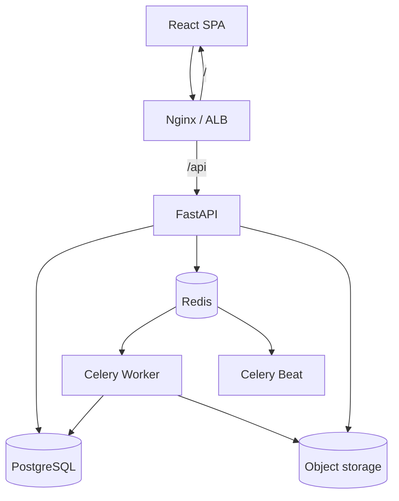

<p align="center">
  
</p>

# Restaurant Resource Planning System (RRPS)

**Enterprise Restaurant ERP + ML Forecasting Platform — v1.0.0**

Multi-tenant restaurant operations suite: master data, catalog & inventory, POS/KDS, CRM & HRMS, analytics/BI, automation admin, SaaS billing, and a self-learning demand forecaster — packaged with Docker, CI/CD, and AWS-oriented infrastructure.

[](https://github.com/Sudharsen27/Restaurant-Resource-Planning-System-AI/actions/workflows/ci.yml)
[](docs/deployment/docker-compose.md)
[](Backend/requirements.txt)
[](Frontend/package.json)
[](Backend/requirements.txt)
[](docker-compose.yml)
[](LICENSE)
[](CHANGELOG.md)

---

## Table of contents

- [Project overview](#project-overview)
- [Key features](#key-features)
- [Technology stack](#technology-stack)
- [Folder structure](#folder-structure)
- [Screenshots](#screenshots)
- [Architecture](#architecture)
- [Installation](#installation)
- [Environment variables](#environment-variables)
- [Running locally](#running-locally)
- [Running with Docker](#running-with-docker)
- [API documentation](#api-documentation)
- [Testing](#testing)
- [CI/CD pipeline](#cicd-pipeline)
- [Deployment guide](#deployment-guide)
- [Roadmap](#roadmap)
- [Contributing](#contributing)
- [License](#license)

---

## Project overview

RRPS is a full-stack **Restaurant Resource Planning** system for multi-branch restaurants and SaaS operators. It combines classical ERP modules with an ML demand forecaster that learns from manager feedback.

| Audience | Value |
|----------|--------|
| Operators | POS, kitchen, floor, inventory, payroll |
| Managers | Forecasts, BI insights, staff & stock plans |
| Platform admins | Jobs, webhooks, health, backups, SaaS billing |
| Developers | OpenAPI, Docker, GitHub Actions, CDK scaffolding |

**Status:** Version **1.0.0** tagged. Business features are feature-complete for v1; current focus is production hardening and cloud cutover.

---

## Key features

- **ERP master data** — restaurants, branches, dining areas, tables, departments, documents
- **Catalog & inventory** — products, suppliers, warehouses, PO → GRN, recipes, menu, transfers, alerts
- **POS & operations** — tickets, payments, KDS, floor plan, merge/split tables
- **CRM & HRMS** — loyalty, reservations, shifts, attendance, leave, payroll
- **Analytics & BI** — executive dashboards, insights, alerts, assistant query
- **Automation admin** — workflows, job scheduler, API keys, webhooks, audit
- **Multi-tenant SaaS** — organizations, plans, invoices, onboarding, super-admin
- **ML forecasting** — predict demand, retrain, version models, recommendations
- **Platform ops** — health center, cache/queue monitors, backups, storage status
- **Production baseline** — Redis, Celery, Docker Compose, CI lint/test/build, security middleware

---

## Technology stack

| Layer | Stack |
|-------|--------|
| Frontend | React 19, Vite 8, Tailwind CSS 4, TanStack Query, React Router 7, Recharts |
| Backend | FastAPI, SQLAlchemy 2, Pydantic v2, Alembic, Uvicorn/Gunicorn |
| Data | PostgreSQL 16, Redis 7 |
| Jobs | Celery (worker + beat) |
| ML | scikit-learn, pandas, joblib |
| Edge | Nginx (Compose) / Application Load Balancer (AWS) |
| Cloud | ECR, ECS Fargate, RDS, ElastiCache, S3, Secrets Manager, CloudWatch (target) |
| IaC | AWS CDK (TypeScript) in `infrastructure/` |
| CI/CD | GitHub Actions |

---

## Folder structure

```text
Restaurant-resource-planning-system/
├── Backend/                 # FastAPI app, Celery, Alembic, ML artifacts
│   ├── app/                 # api, services, models, middleware, tasks
│   ├── tests/
│   ├── migrations/
│   ├── Dockerfile
│   └── Dockerfile.worker
├── Frontend/                # React SPA
│   ├── src/
│   └── Dockerfile
├── docs/                    # Enterprise documentation
│   ├── architecture/        # Mermaid diagrams & flows
│   ├── api/                 # REST reference + endpoint index
│   ├── deployment/          # Compose + AWS
│   ├── guides/              # Local, testing, CI/CD
│   ├── security/
│   ├── screenshots/
│   └── archive/phase-reports/
├── env/                     # Stage-specific *.env.example
├── infra/                   # Local nginx / postgres / redis configs
├── infrastructure/          # AWS CDK stacks
├── scripts/                 # Doc/tooling helpers
├── docker-compose.yml
├── LICENSE
├── CHANGELOG.md
├── CONTRIBUTING.md
├── SECURITY.md
└── README.md
```

> **Naming:** `infra/` = Compose runtime configs · `infrastructure/` = AWS CDK. Do not conflate.

---

## Screenshots

Add PNG captures under [`docs/screenshots/`](docs/screenshots/). Suggested:

| Dashboard | POS | Forecast | Platform ops |
|-----------|-----|----------|--------------|
| `dashboard.png` | `pos.png` | `forecast.png` | `platform-ops.png` |

See [docs/screenshots/README.md](docs/screenshots/README.md).

---

## Architecture



Detailed diagrams (auth, forecast, inventory, orders, jobs, AWS topology):

**[docs/architecture/](docs/architecture/)**

---

## Installation

### Prerequisites

- Git
- Docker Desktop / Engine 24+ (recommended), **or**
- Python 3.12+, Node.js 22+, PostgreSQL 16, Redis 7

### Clone

```bash
git clone https://github.com/Sudharsen27/Restaurant-Resource-Planning-System-AI.git
cd Restaurant-Resource-Planning-System-AI
```

---

## Environment variables

Copy a template and edit:

```bash
cp env/development.env.example Backend/.env
cp Frontend/.env.example Frontend/.env
```

| Area | Examples |
|------|----------|
| Core | `APP_ENV`, `SECRET_KEY`, `DATABASE_URL`, `CORS_ORIGINS` |
| Redis/Celery | `REDIS_URL`, `CELERY_BROKER_URL`, `CELERY_RESULT_BACKEND` |
| Storage | `STORAGE_BACKEND`, `S3_BUCKET`, `AWS_REGION` |
| Frontend | `VITE_API_BASE_URL=/api/v1` |

Full reference: [docs/deployment/environment-variables.md](docs/deployment/environment-variables.md)

---

## Running locally

See **[docs/guides/local-development.md](docs/guides/local-development.md)**.

```bash
# Backend
cd Backend && pip install -r requirements.txt
python scripts/migrate.py
uvicorn app.main:app --reload --port 8000

# Frontend
cd Frontend && npm install && npm run dev
```

- API docs: http://localhost:8000/docs  
- SPA (Vite): http://localhost:5173  

---

## Running with Docker

```bash
docker compose up --build -d
docker compose --profile migrate run --rm migrate
```

| URL | Service |
|-----|---------|
| http://localhost | App (nginx) |
| http://localhost/api/v1/health/live | Liveness |

Guide: [docs/deployment/docker-compose.md](docs/deployment/docker-compose.md)

---

## API documentation

| Resource | Link |
|----------|------|
| Docs hub | [docs/api/](docs/api/) |
| Auth | [docs/api/auth.md](docs/api/auth.md) |
| Full index (~293 routes) | [docs/api/ENDPOINT_INDEX.md](docs/api/ENDPOINT_INDEX.md) |
| Swagger (runtime) | `/docs` |
| ReDoc | `/redoc` |

Authenticate with:

```http
Authorization: Bearer <access_token>
```

---

## Testing

```bash
# Backend
cd Backend && pytest -q

# Frontend
cd Frontend && npm run lint && npm run build
```

Details: [docs/guides/testing.md](docs/guides/testing.md)

---

## CI/CD pipeline

GitHub Actions:

| Workflow | Purpose |
|----------|---------|
| [`ci.yml`](.github/workflows/ci.yml) | Backend tests, frontend lint/build, Docker builds |
| [`deploy.yml`](.github/workflows/deploy.yml) | Tag/manual deploy (GHCR + hooks) |

Guide: [docs/guides/cicd.md](docs/guides/cicd.md)

---

## Deployment guide

| Target | Doc |
|--------|-----|
| Docker Compose | [docs/deployment/docker-compose.md](docs/deployment/docker-compose.md) |
| AWS ECS Fargate | [docs/deployment/aws-ecs.md](docs/deployment/aws-ecs.md) |
| RDS + ElastiCache | [docs/deployment/aws-data.md](docs/deployment/aws-data.md) |
| HTTPS / ALB | [docs/deployment/https-networking.md](docs/deployment/https-networking.md) |
| Production gate | [docs/PRODUCTION_CHECKLIST.md](docs/PRODUCTION_CHECKLIST.md) |

---

## Roadmap

### 1.1.0 — Harden & cloud-complete

- JWT on remaining public ML/legacy write APIs
- Production config guards
- Finish ECS/ALB/ECR CDK + deploy pipeline
- Broader integration + E2E tests
- README screenshots

### 2.0.0 — Scale the platform

- SSO/OIDC, stronger tenant isolation audits
- Multi-region DR, WAF
- Event-driven integrations at scale

See [docs/REPOSITORY_AUDIT.md](docs/REPOSITORY_AUDIT.md) for scored audit notes.

---

## Contributing

Please read [CONTRIBUTING.md](CONTRIBUTING.md).  
Security reports: [SECURITY.md](SECURITY.md).

---

## License

MIT © [Sundar Digital](https://www.sundardigital.in/) — see [LICENSE](LICENSE).

---

**RRPS v1.0.0** · Built by [Sundar Digital](https://www.sundardigital.in/) for restaurant operators and platform teams who need ERP depth with forecasting intelligence.
