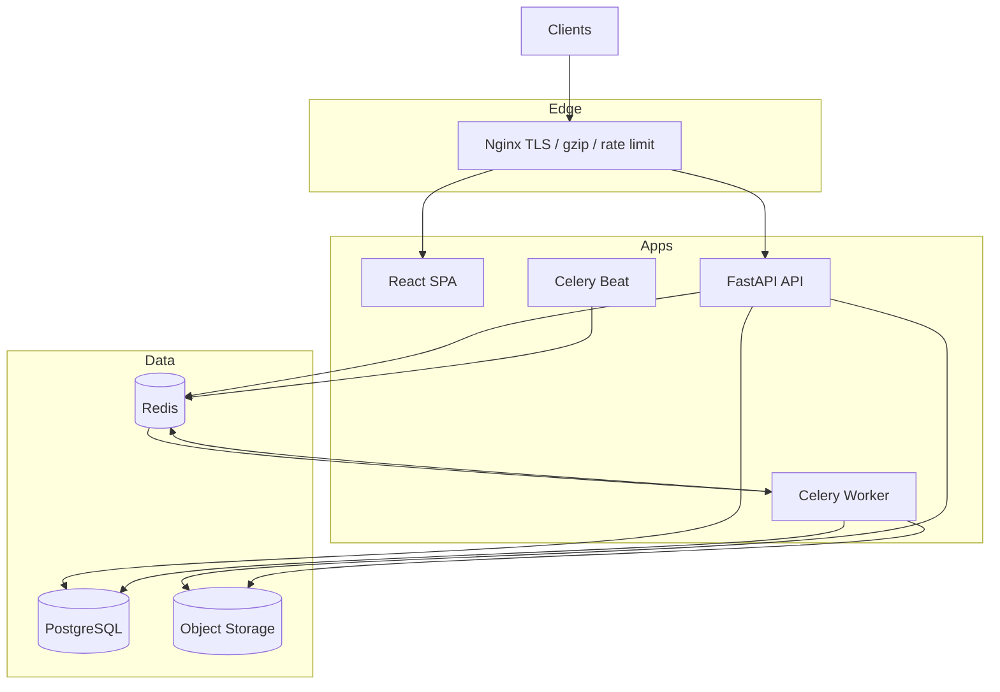
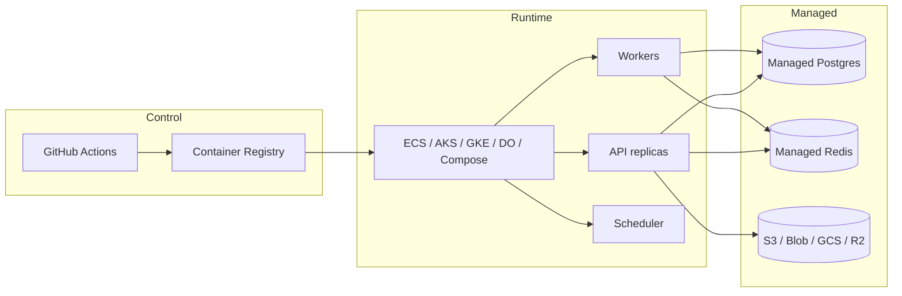

# Architecture & Infrastructure Diagrams

## Application architecture

## Multi-cloud deployment pattern

## Security layers

1. Edge TLS + CSP/HSTS headers (Nginx + FastAPI middleware)
2. JWT access + rotating refresh tokens
3. Optional CSRF for cookie flows; bearer SPA exempt
4. Redis rate limiting
5. RBAC on platform ops endpoints
6. Secrets outside git
