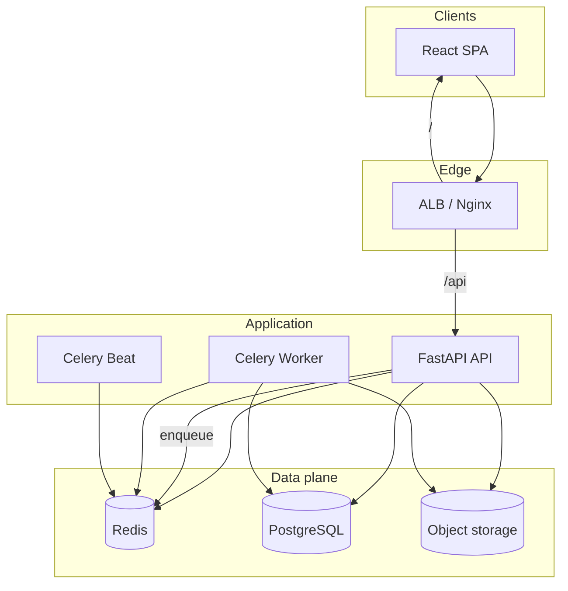

# Architecture Overview

Restaurant Resource Planning System (RRPS) is a multi-tenant restaurant ERP with forecasting, POS, inventory, CRM/HRMS, BI, and platform operations.

## High-level request path

## Component responsibilities

| Component | Role |
|-----------|------|
| **Frontend** | React 19 SPA (Vite); talks to `/api/v1` |
| **FastAPI** | REST API, auth, business logic, health/metrics |
| **PostgreSQL** | System of record (ERP, SaaS, auth sessions, ML metadata) |
| **Redis** | Cache, rate limits, Celery broker/results |
| **Celery Worker** | Async jobs (email, reports, inventory, notifications) |
| **Celery Beat** | Scheduled tasks |
| **Nginx / ALB** | TLS termination, path routing |
| **S3 (optional)** | Uploads, backups, exports |

## Repository layout (infra naming)

| Path | Purpose |
|------|---------|
| `infra/` | Local Compose configs (nginx, postgres init, redis.conf) |
| `infrastructure/` | AWS CDK (VPC, RDS, ElastiCache, compute scaffolding) |
| `env/` | Environment templates by stage |
| `docs/` | Product and ops documentation |

## Related diagrams

- [System context](system-context.md)
- [Authentication flow](authentication-flow.md)
- [Forecast pipeline](forecast-pipeline.md)
- [Inventory flow](inventory-flow.md)
- [Order / POS flow](order-flow.md)
- [Background jobs](background-jobs.md)
- [Deployment topology](deployment-topology.md)
