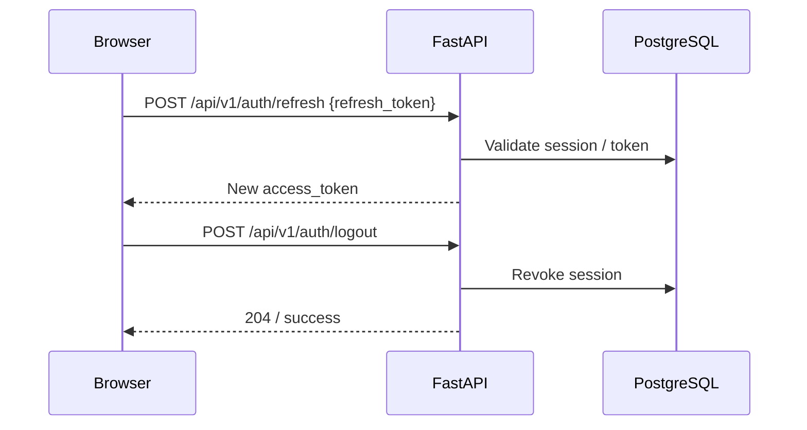

# Authentication Flow

## Login and token issuance

```mermaid
sequenceDiagram
  participant U as Browser
  participant API as FastAPI
  participant DB as PostgreSQL
  participant R as Redis

  U->>API: POST /api/v1/auth/login {email, password}
  API->>DB: Lookup user + verify bcrypt hash
  alt Invalid / locked
    API-->>U: 401 / 423
  else Success
    API->>DB: Create session row
    API-->>U: access_token + refresh_token
    Note over U: Store tokens; Authorization Bearer
  end

  U->>API: GET /api/v1/auth/me
  API->>API: Decode JWT + load user
  API-->>U: User profile + roles
```

## Refresh and logout



## Authorization model

| Mechanism | Usage |
|-----------|--------|
| JWT Bearer | Most ERP / POS / CRM / admin / SaaS routes |
| Role checks | `require_roles(...)` (e.g. SUPER_ADMIN, ADMIN, MANAGER) |
| Super admin | SaaS backfill / super-admin dashboard |
| Public | Health, login, password reset, some legacy ML routes |

> **v1.0 note:** Some forecast/ML and legacy planning endpoints are intentionally reachable without JWT for demo/learning. Locking them down is a **1.1.0** hardening item. See [SECURITY_REVIEW](../security/SECURITY_REVIEW.md).

## Password reset

1. `POST /api/v1/auth/forgot-password` — always returns generic success (anti-enumeration).
2. Email contains time-limited reset token (when SMTP configured).
3. `POST /api/v1/auth/reset-password` — sets new password after validation.
