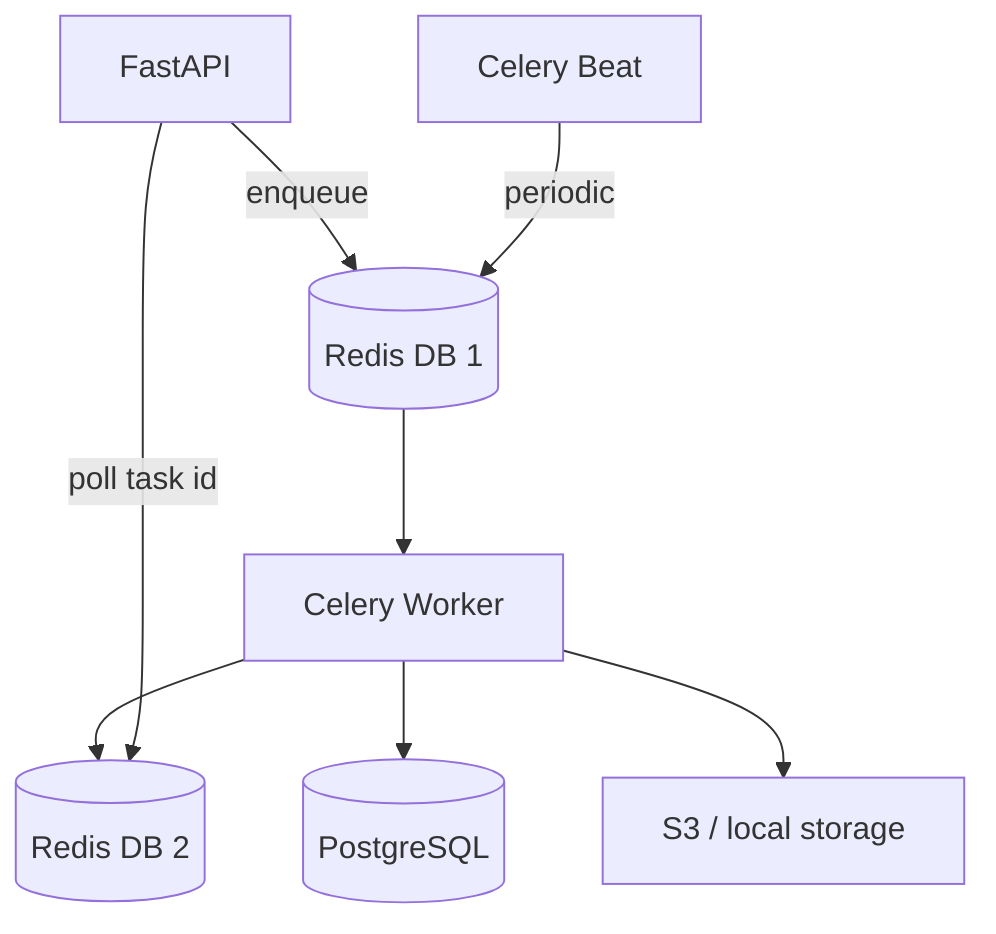

# Background Job Flow

## Process roles

| Process | Image | Command |
|---------|-------|---------|
| API | `Backend/Dockerfile` | `uvicorn app.main:app` |
| Worker | `Backend/Dockerfile.worker` | `celery … worker` |
| Scheduler | same worker image | `celery … beat --schedule=/tmp/celerybeat-schedule` |

## Typical tasks

- Email / notification dispatch
- Report generation and scheduled exports
- Inventory / analytics batch jobs
- Backup orchestration (platform APIs)

## Ops APIs

- `GET /api/v1/platform/queue`
- `POST /api/v1/platform/queue/enqueue`
- `GET /api/v1/platform/queue/tasks/{task_id}`
- Admin job scheduler under `/api/v1/admin/jobs*`

## Production notes

- Run **exactly one** Beat task on ECS/Fargate.
- Prefer ElastiCache with TLS (`rediss://`) in AWS.
- Set `CELERY_TASK_ALWAYS_EAGER=false` outside tests.
