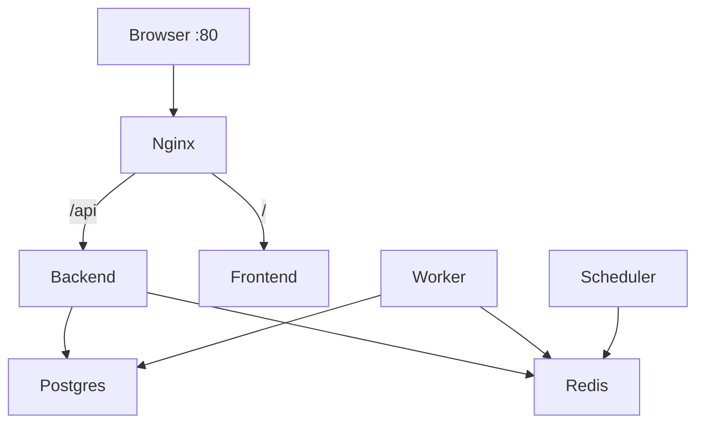
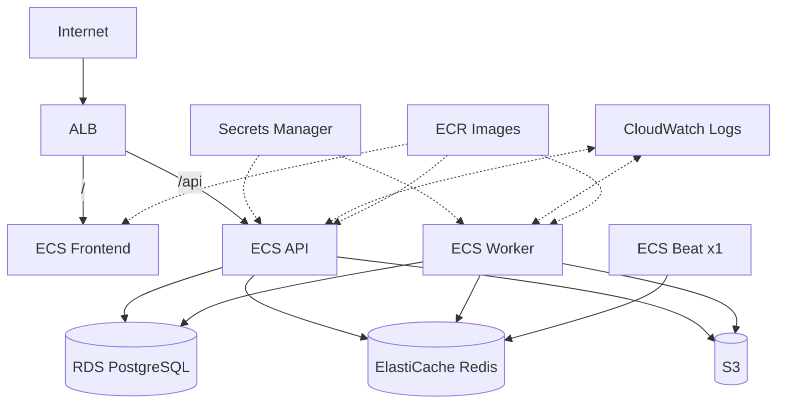

# Deployment Topology

## Local / Compose

## AWS target (v1.0 scaffolding → v1.1 complete)

CDK lives in `infrastructure/` (`network`, `database`, `cache`, `compute` stacks). Full ECS service definitions and ALB rules are the primary **1.1.0** infra milestone.
