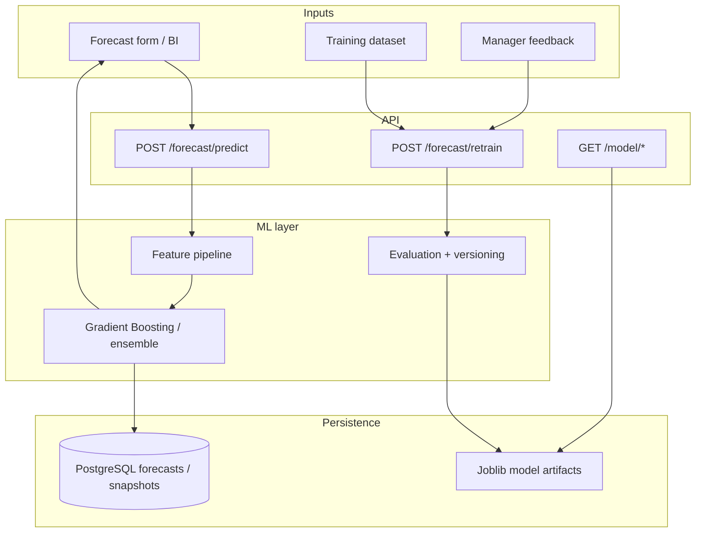

# Forecast Pipeline

## Steps

1. **Predict** — client sends restaurant context features; API loads production model; returns predicted customers/revenue band + confidence.
2. **Persist** — forecast rows and dashboard snapshots stored in PostgreSQL.
3. **Feedback** — managers submit actuals via `/feedback`; stored for learning.
4. **Retrain** — `/forecast/retrain` or `/model/retrain` rebuilds features, trains, evaluates, versions (`vN`), optionally promotes production model.
5. **Recommend** — `/recommendation/*` turns forecast into staff and inventory plans.

## Related APIs

See [API · ML & Forecast](../api/ml-forecast.md).
