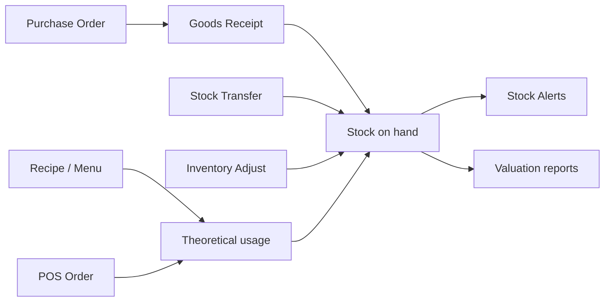

# Inventory Flow

## Lifecycle

1. **Master data** — products, categories, units, suppliers, warehouses.
2. **Procurement** — create → submit → approve → order PO; receive via goods receipts.
3. **Transfers** — move stock between warehouses/branches with approve/complete.
4. **Adjustments** — inventory transactions for waste, count corrections.
5. **Consumption** — POS orders with `deduct_stock` reduce on-hand via recipes/menu links.
6. **Visibility** — stock alerts, low-stock / expiry / movement BI reports.

## Key endpoints

| Area | Base path |
|------|-----------|
| Products | `/api/v1/products` |
| Purchase orders | `/api/v1/purchase-orders` |
| Goods receipts | `/api/v1/goods-receipts` |
| Transfers | `/api/v1/stock-transfers` |
| Transactions | `/api/v1/inventory-transactions` |
| Alerts | `/api/v1/stock-alerts` |
| Catalog reports | `/api/v1/catalog/reports/*` |
