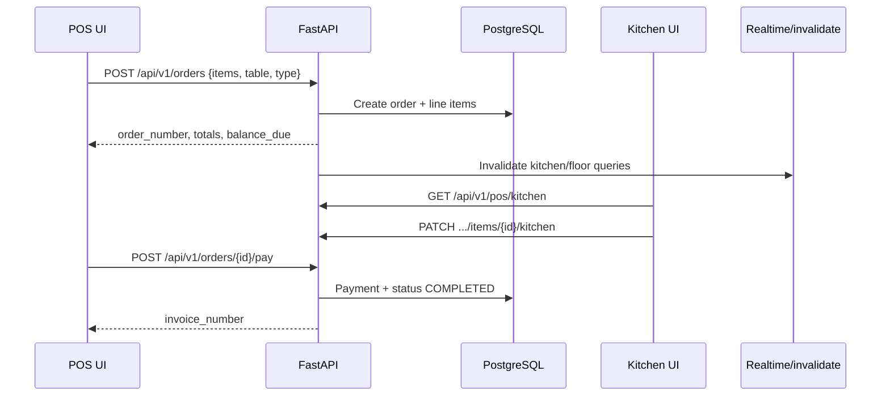

# Order / POS Flow

## Order types

`DINE_IN` · `TAKEAWAY` · `DELIVERY` · `ONLINE`

## Supporting surfaces

| Surface | Path |
|---------|------|
| POS ticket | `/pos` |
| Kitchen display | `/kitchen` |
| Floor plan | `/floor` |
| Payments | `/payments` |
| POS dashboard API | `GET /api/v1/pos/dashboard` |

## Stock deduction

When `deduct_stock: true`, order placement triggers inventory consumption based on menu/recipe mapping (async-capable via Celery for heavier workloads).
