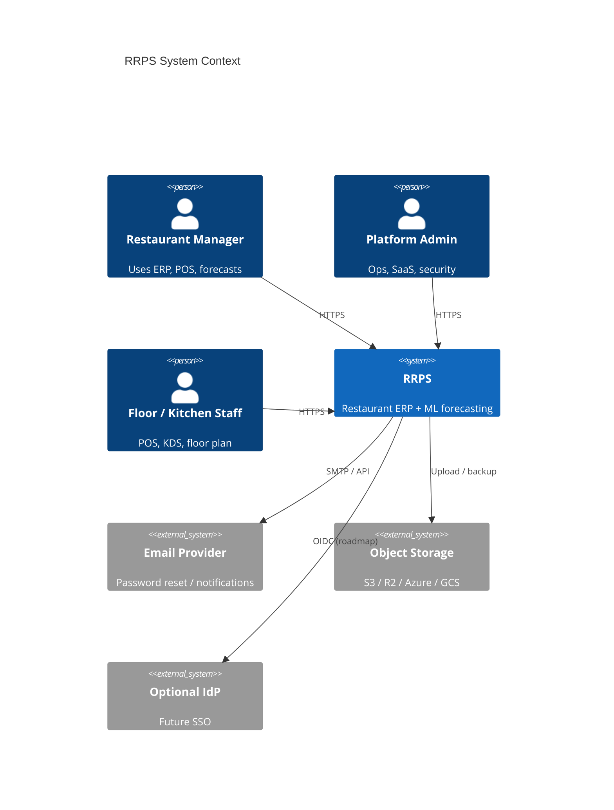
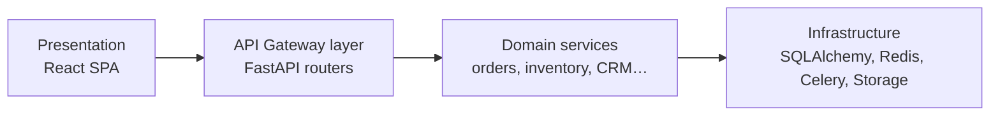

# System Context

## Logical layers

## Multi-tenancy (SaaS)

Organizations → restaurants → branches. Super-admin APIs under `/api/v1/saas/*` manage plans, billing, and onboarding. Tenant isolation is enforced in application services for SaaS-scoped resources.
